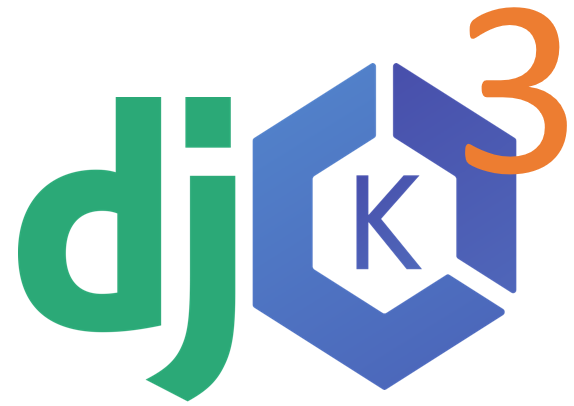

<!-- PROJECT LOGO -->
<br />
<p align="center">
  <a href="https://github.com/rebataur/djkube">
    
  </a>

  <h3 align="center">djkube (previously fsKube) - Django Developer's full-stack Kubernetes enabler</h3>

  <p align="center">
 If you are a Python Django developer then djkube provides you with best user experience in easily running your full-stack Django apps on Kubernetes in AWS with just a few clicks.
    <br />
    <!-- <a href="https://github.com/rebataur/djkube"><strong>Explore the docs »</strong></a> -->
    <br />
    <br />
    <a href="https://www.youtube.com/watch?v=Nt5yowdwm5Q">View Demo</a>
    ·
    <a href="https://github.com/rebataur/djkube/issues">djkube Bug</a>
    ·
    <a href="https://github.com/rebataur/djkube/issues">Request Feature</a>
  </p>
</p>


<!-- TABLE OF CONTENTS -->
## Table of Contents

* [About the Project](#about-the-project)
  * [Built With](#built-with)
* [Getting Started](#getting-started)
  * [Prerequisites](#prerequisites)
  * [Installation](#installation)
* [Usage](#usage)
* [Roadmap](#roadmap)
* [Contributing](#contributing)
* [License](#license)
* [Contact](#contact)
* [Acknowledgements](#acknowledgements)


<!-- ABOUT THE PROJECT -->
## About The Project

[![Product Name Screen Shot][product-screenshot]](https://www.youtube.com/watch?v=Nt5yowdwm5Q)


### Built With

* [Python]()
* [Bootstrap]()
* [AWS Libraries]()
* [Kubernetes Libraries]()


<!-- GETTING STARTED -->
## Getting Started
### Please note the following
* Currently only runs on Windows
* Linux and Mac ports coming soon.

### For Convenience Download single executable for Windows
https://github.com/rebataur/djkube/releases/download/v0.1.8/djkube.exe

### Prerequisites

This is an example of how to list things you need to use the software and how to install them.
* Currently tested only on Windows
* Python 3.7+

### Installation
 
1. Clone the djkube
```sh
git clone https://github.com/rebataur/djkube.git
```
2. Create virtualenv
```sh
cd djkube
virtualenv venv
venv\scripts\activate
```
3. Install djkube
```sh
pip install -r requirements.txt
```
4. Run the flask app
```sh
>set FLASK_APP=djkube.py
>set FLASK_DEBUG=FALSE 
>set FLASK_RUN_PORT=5678
>flask run
```


6. Launch http://localhost:5678 in your browser

<!-- USAGE EXAMPLES -->
## Usage
KubeConfig file is stored in your YOUR_USER_DIRECTORY/.djkube/YOUR_CLUSTER_ID


Please watch a detailed video of djkube below.

[](http://www.youtube.com/watch?v=Nt5yowdwm5Q "Demo Video of djkube")


<!-- ROADMAP -->
## Roadmap

1. Spot Instances
2. AMD Based Instances
3. Graviton based Instances
4. AutoScaling Group

See the [open issues](https://github.com/rebataur/djkube/issues) for a list of proposed features (and known issues).


<!-- CONTRIBUTING -->
## Contributing

Contributions are what make the open source community such an amazing place to be learn, inspire, and create. Any contributions you make are **greatly appreciated**.

1. Fork the Project
2. Create your Feature Branch (`git checkout -b feature/AmazingFeature`)
3. Commit your Changes (`git commit -m 'Add some AmazingFeature'`)
4. Push to the Branch (`git push origin feature/AmazingFeature`)
5. Open a Pull Request


<!-- LICENSE -->
## License

Distributed under the MIT License. See `LICENSE` for more information.


<!-- CONTACT -->
## Contact

Your Name - [@rebataur](https://twitter.com/rebataur) - hello@rebataur.com

Project Link: [https://github.com/rebataur/djkube](https://github.com/rebataur/djkube)


<!-- ACKNOWLEDGEMENTS -->
## Acknowledgements
We stand on the shoulders of giants!
This project would not have been possible without the following projects.

* [eksctl]()
* [aws cli]()
* [linkerd]()
* [velero]()
* [ELK Stack]()
* [Metrics-Server]()
* [Kubernetes]()
* [Kubectl]()


<!-- MARKDOWN LINKS & IMAGES -->
<!-- https://www.markdownguide.org/basic-syntax/#reference-style-links -->
[contributors-shield]: https://img.shields.io/github/contributors/othneildrew/Best-README-Template.svg?style=flat-square
[contributors-url]: https://github.com/rebataur/djkube/graphs/contributors
[forks-shield]: https://img.shields.io/github/forks/othneildrew/Best-README-Template.svg?style=flat-square
[forks-url]: https://github.com/rebataur/djkube/network/members
[stars-shield]: https://img.shields.io/github/stars/othneildrew/Best-README-Template.svg?style=flat-square
[stars-url]: https://github.com/rebataur/djkube/stargazers
[issues-shield]: https://img.shields.io/github/issues/othneildrew/Best-README-Template.svg?style=flat-square
[issues-url]: https://github.com/rebataur/djkube/issues
[license-shield]: https://img.shields.io/github/license/othneildrew/Best-README-Template.svg?style=flat-square
[license-url]: https://github.com/rebataur/djkube/blob/master/LICENSE.txt
[linkedin-shield]: https://img.shields.io/badge/-LinkedIn-black.svg?style=flat-square&logo=linkedin&colorB=555
[linkedin-url]: https://www.linkedin.com/company/rebataur.com/
[product-screenshot]: images/screenshot.png
